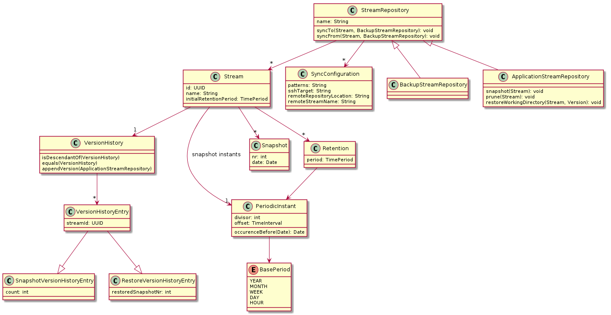

# BTRBCK

Backup tool leveraging BTRFS for incremental backups. Key features:

* **Atomic Copy**: No need to shut your servers down for backup
* **Incremental Snapshots**: Take incremental snapshots,
freely configure how long they are kept.
* **Snapshot transfer via SSH**: Widespread and secure way of data transfer.
* **Simple Command Line Tool**: Easy to setup, easy to use.
* **Look at your Snapshots any Time**: Snapshots are directly visible in the
file system.

## Introduction
Traditional backup systems have two inherent pain points which
are solved by the use of BTRFS snapshots for backup:

1. **No Atomic Snapshots**: The files are copied one by one. To take
a consistent snapshot, your application has to be stopped before the
backup. This makes the backup process more difficult to set up and 
prohibits frequent backups. Since BTRFS snapshots are atomic, snapshots
can be taken at any time. If the snapshot is restored, it looks to the
application as if a power loss had occurred.

2. **Cumbersome Incremental Snapshots**: Managing a combination of 
full and incremental backups is complicated and the restore time
might suffer. With BTRBCK, the snapshots on the backup server are kept within
a BTRFS file system. Snapshots just share common data and store the 
differences at a block level. There its no distinction between full and 
incremental snapshots. The time penalty of restoring a full backup an applying
tens of incremental backups goes away. Any snapshot can be deleted,
without affecting any other snapshot.

BTRBCK works with so called snapshot streams. All data of an application (Database, File store, ...)
has to be placed in the working directory of a single stream. Then snapshots of the working directory
can be taken and transferred to another system.

Streams are organized in stream repositories. This allows to share some configuration
(like the destination host to push snapshots to) and to perform bulk operations (take a snapshot for
each stream in the repository). There are two types of stream repositories: application stream repositories, 
which contain a working directory for each stream, and backup stream repositories, which do not contain working
directories. Besides this, the two repository types have identical functionality.
Backup stream repositories are intended to be used on backup hosts, where no working directories are required, while
application stream repositories are required to run applications.

To set up a backup, your server and your backup host need to use a BTRFS file system. Create an application
stream repository on the server and a backup stream repository on the backup host. Now you can create streams
on the server and sync them to the backup host.

## Getting Started
BTRBCK is distributed as debian package or as executable jar. Releases can be found under https://github.com/ruediste1/btrbck/releases.
Install the package using

    wget https://github.com/ruediste1/btrbck/releases/download/1.0/btrbck-cli_1.0_all.deb && sudo dpkg -i btrbck-cli_1.0_all.deb

Now you can create your first stream repository. First, open a root shell

    sudo su
    
Create an empty directory on a BTRFS file system and run

    btrbck create -a

Followed by

    btrbck create myStream

to create your first stream. This created a `myStream` directory in the repository. Create a file and take a snapshot:

    echo "Hello" > myStream/world.txt
    btrbck snapshot myStream
    
Running `find .` you can see the working directory and the snapshot which has been taken. Delete the file and take a snapshot again

    rm myStream/world.txt
    btrbck snapshot myStream
    
Now, you can restore the file using

    btrbck restore myStream 0

To conclude this section, setup BTRBCK on a second system. Create a stream repository and setup ssh with public key authentication
for the root user. Then run 
    
    btrbck push myStream root@<host> <remote repo path>
    
This will transfer all snapshots to the remote host. Please not that for this to work, the root of the file system has 
to be mounted directly. Subvolume mounts do not work for send/receive due to a bug in `btrfs-tools`.

## Permissions
To operate, BTRBCK needs to invoke the `btrfs` and `chown` commands as super user. This 
also includes invocation on remote systems (`push` and `pull` to/from other hosts), where
sudo has to be set up in password less configuration. This can be accomplished by 

1. running `btrbck` as root
1. using `sudo btrbck`
1. instructing `btrbck` to use sudo commands

Variant 1 is the simplest and needs no further explanation. For variant 2, you have to use
the `-sudoRemoteBtrbck` flag and add an `/etc/sudoers.d/btrbck` file with the following contents:

    %sudo	ALL = (ALL) NOPASSWD: /usr/bin/btrbck

For variant 3, add a `/etc/sudoers.d/btrbck` file with the following. In addition, the
`-sudo` and `-sudoRemoteBtrfs` flags have to be specified on the command line.

    %sudo	ALL = (ALL) NOPASSWD: /sbin/btrfs
    %sudo	ALL = (ALL) NOPASSWD: /bin/chown

## Snapshot Retention
Taking snapshots is all good an fine, but at some time you'll want to thin them out. If snapshots are taken every 10 minutes,
a snapshot retention configuration might look as follows:

* keep all snapshots for one hour
* keep one snapshot per hour for one day
* keep 4 snapshots a day for a week
* keep one snapshot a week for a month
* keep one snapshot a month for a year
* keep one snapshot per year for 10 years.
* keep one snapshot per decade for 100 years.

This can be configured on a per stream level. The stream configuration file can be found in `.backup/<stream name>/<stream name>.xml`
for application stream repositories and in `<stream name>/<stream name>.xml` in backup stream repositories. The following is
the configuration for the example above:

    <?xml version="1.0" encoding="UTF-8" standalone="yes"?>
    <stream initialRetentionPeriod="PT1H" snapshotInterval="PT10M">
      <retention period="P1D"   timeUnit="HOUR"   snapshotsPerTimeUnit="1"/>
      <retention period="P1W"   timeUnit="DAY"    snapshotsPerTimeUnit="4"/>
      <retention period="P1M"   timeUnit="WEEK"   snapshotsPerTimeUnit="1"/>
      <retention period="P1Y"   timeUnit="MONTH"  snapshotsPerTimeUnit="1"/>
      <retention period="P10Y"  timeUnit="YEAR"   snapshotsPerTimeUnit="1"/>
      <retention period="P100Y" timeUnit="DECADE" snapshotsPerTimeUnit="1"/>
    </stream>

The `snapshotIterval` will be discussed below. All Periods are specified according to [ISO 8601](http://en.wikipedia.org/wiki/ISO_8601).
Basically, the format is `PnYnMnDTnHnMnS`, where zeros can be omitted and the `T` is used to indicate the start of the time part.

For each retention, the beginning of the `period` is determined and truncated to the last start of `timeUnit`. Then 
`snapshotsPerTimeUnit` instants are evenly distributed over the time unit. For each instant, the next snapshot after the instant
is marked to be retained. This is repeated for all time units within the period. Afterwards, all snapshots not marked for
retention are deleted. These operations are performed in the UTC time zone.

To perform the pruning, run `btrbck prune` to prune all streams, or `btrbck prune <stream name>` to prune a single stream.
If neither initialRetentionPeriod nor any retentions are defined, no snapshots are pruned.

## Snapshot Transfer
Snapshots can be transferred in an incremental manner between snapshot repositories, which are typically on different systems. For
the transfer, SSH is used. The BTRBCK tool initiates an SSH connection to the remote host and starts the btrbck tool. The data
is then transferred via stdin and stdout.

For this to work, there may be no password prompts. For SSH, this can be accomplished by using public key authentication. To run 
the BTRBK tool, this can be accomplished as outlined in the getting started section.

Snapshots are trasferred using the `btrbck push` or `btrbck pull` commands. By using the `-c` switch, streams are created in the
target repository if they do not exist. At this point, the stream configuration is copied. After that, the stream configuration
is never touched again. Thus, modifications to the snapshot retentions are not synchronized automatically. This is intentional, to
protect you from loosing snapshots due to a single misconfiguration. 

If the same stream is copied to multiple application stream repositories, working on both and transferring the snapshots to a 
single backup repository would result in a big mess. This is addressed by the stream version history. Each copy of a stream gets
its unique ID. Whenever snapshots are taken or restored, this is recorded in the history. Before snapshots are transferred it
is checked if target stream is an ancestor of the source stream. If this is not the case, the snapshot transfer is rejected.

For taking snapshots, the history only stores the stream ID and the number of times a snapshot has been taken. Thus, as long as
you don't change the stream instance you are working with, the history remains very compact.  

## Concurrency Control
BTRBCK uses a per repository lock to control concurrent operations on a repository. This
lock can be held manually using `btrbck lock`. When a repository is locked, all operations
wait for the lock before continuing.

## Automatic Processing
BTRBCK has been prepared to operate in a fully automatic manner. This is enabled by adding a cron job running the `btrbck process` command.
The following actions are taken for each stream:

1. Take a snapshot as defined in the `snapshotInterval` in the stream `.xml` file. A snapshot is taken if the last snapshot
is older than the snapshot interval. If you want snapshots for example every hour, make the cron job run process every hour but
set the interval to something less, like 9 minutes 30 seconds. This makes sure that a snapshot is taken whenever the cron job
is run. Otherwise, some snapshots might be skipped.

1. Prune snapshots as defined in the stream `.xml` file.

1. Sync the stream as defined in the repository configuration (see below)

The repository configuration is stored in the `repository.xml` file or in 
`.backup/repository.xml`. It contains the synchronization configuration for the repository.
Multiple configurations are allowed.

    <?xml version="1.0" encoding="UTF-8" standalone="yes"?>
    <applicationStreamRepository>
      <syncConfiguration 
        direction="PULL" 
        sshTarget="user@host:port" 
        remoteRepoLocation="/backup" 
        createRemoteIfNecessary="true" 
        streamPatterns="*"/>
    </applicationStreamRepository>

The direction can be `PULL` or `PUSH`.
The `streamPatterns` attribute is a comma separated
list. Each element is the name of a stream which may contain * as
wildcard. If an element starts with a - any matching stream will be
excluded from the set of synced streams. For each local stream name, the
list is traversed from left to right. The first match decides if the
stream is in the set of synced streams or not. If no pattern matches, the
stream is not included in the set of synced streams.

## Development
The unit tests expect `/data/tmp` to reside on a btrfs file system. Due to a bug in `btrfs-tools`, the root of the file system has 
to be mounted directly. Subvolume mounts do not work for send/receive.

Class Diagram

